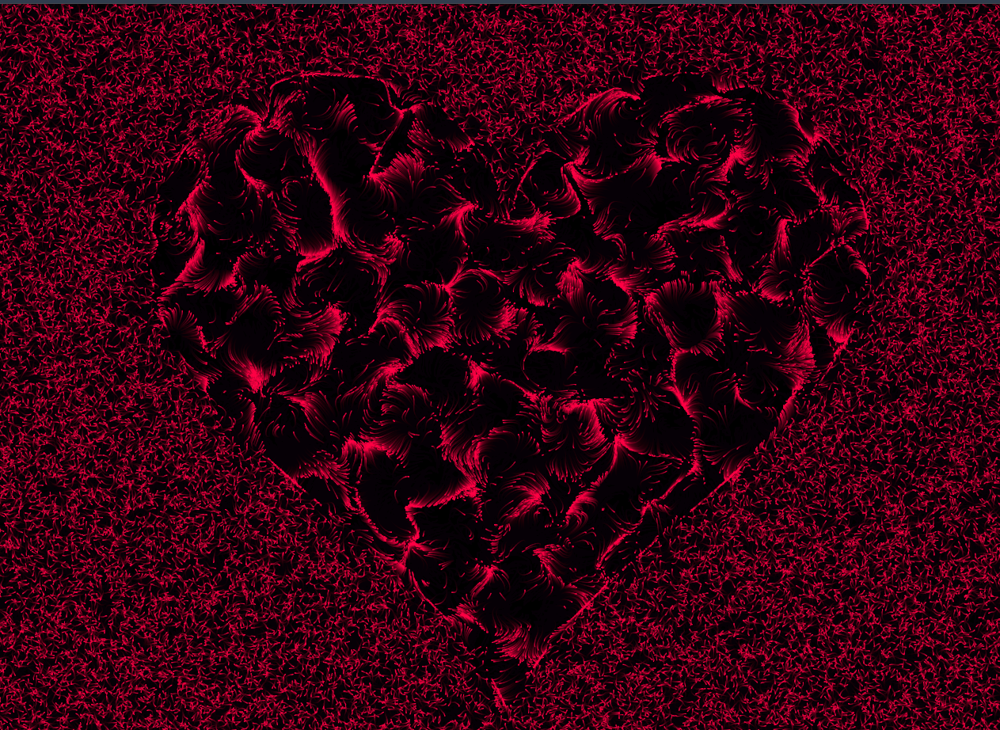
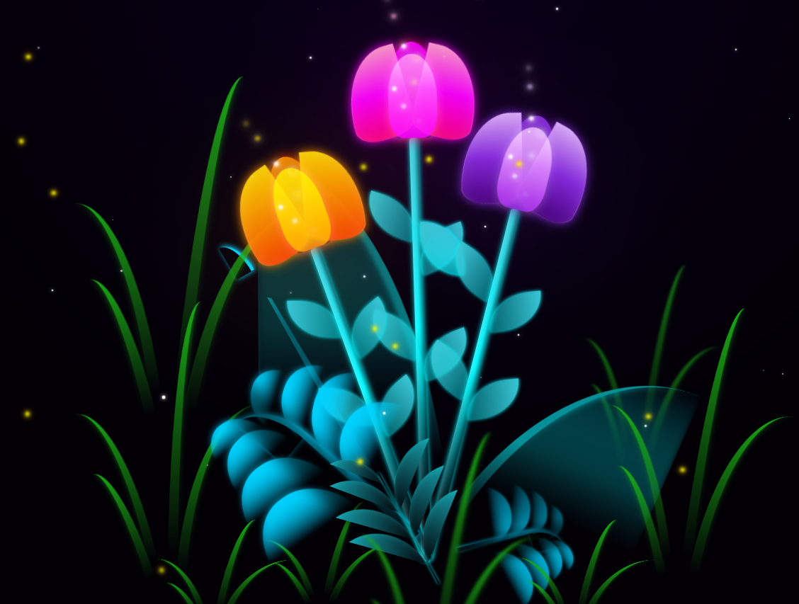
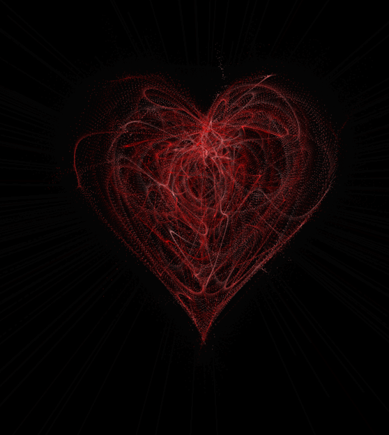

# 💖 Creative Web Animations Collection
*Etkileşimli – Romantik – Yaratıcı Web Animasyonları*


> 🎨 *Kod ve sanatın kesiştiği noktada kalp atışları, parçacık akışları ve interaktif karakterlerle dolu bir deneyim...*

---

## 🚀 Canlı Demolar (Live Preview)

Projeleri tarayıcıda görüntülemek için aşağıdaki linklere tıklayabilirsiniz:

| Animasyon Adı | Canlı Link |
|---------------|------------|
| **Dusty Heart** | [Görüntüle ➜](https://bedirxan36.github.io/Heart-Animations/Dusty%20Heart/) |
| **Flowfield Heart** | [Görüntüle ➜](https://bedirxan36.github.io/Heart-Animations/Flowfield%20Heart/) |
| **Heart Animation** | [Görüntüle ➜](https://bedirxan36.github.io/Heart-Animations/Heart%20Animation/) |
| **Heart Beat** | [Görüntüle ➜](https://bedirxan36.github.io/Heart-Animations/Heart%20Beat/) |
| **Heart Letter** | [Görüntüle ➜](https://bedirxan36.github.io/Heart-Animations/Heart%20Letter/) |
| **Sad Happy Bear** | [Görüntüle ➜](https://bedirxan36.github.io/Heart-Animations/Sad%20Happy%20Bear/) |
| **Tulip Flower** | [Görüntüle ➜](https://bedirxan36.github.io/Heart-Animations/Tulip%20Flower/) |

> **Not:** Ana sayfa ve tüm liste için: [https://Bedirxan36.github.io/Heart-Animations](https://Bedirxan36.github.io/Heart-Animations)

---

## 📂 Proje İçeriği ve Detaylar

Aşağıdaki klasörler repo içerisinde yer almaktadır:

| Klasör Adı | Açıklama | Teknolojiler |
|------------|----------|--------------|
| **Flowfield Heart** | Akışkan parçacık kalbi simülasyonu | `HTML`, `CSS`, `JS` |
| **Heart Beat** | Ritmik animasyonlara tepki veren kalp | `HTML`, `CSS`, `JS` |
| **Sad Happy Bear** | Karakter animasyonu – interaktif duygusal ifadeler | `HTML`, `CSS`, `JS` |
| **Tulip Flower** | CSS ile çizilmiş neon doğa ve parallax etkisi | `HTML`, `CSS`, `JS` |
| **Heart Letter** | Tıklanınca açılan animasyonlu aşk mektubu | `HTML`, `CSS`, `JS` |
| **Dusty Heart** | Parçacıklarla oluşturulmuş "Tozlu Kalp" efekti | `HTML`, `CSS`, `JS` |
| **Heart Animation** | Nabız gibi atan matematiksel kalp animasyonu | `HTML`, `CSS`, `JS` |

---

## 🛠️ Kullanılan Teknolojiler

Proje tamamen saf web teknolojileri ile geliştirilmiştir:

* **HTML5** → Semantik yapı ve içerik düzeni
* **CSS3** → Görsel tasarım, keyframe animasyonları ve efektler
* **JavaScript (Vanilla)** → Dinamik etkileşimler, Canvas çizimleri ve mantık

---

## 📸 Ekran Görüntüleri

(Buraya projelerden alacağınız ekran görüntülerini `screenshots` klasörüne yükleyip ekleyebilirsiniz)
Bu koleksiyonda yer alan bazı animasyonların önizlemeleri:

| | | |
|:-------------------------:|:-------------------------:|:-------------------------:|
|  <br> **Sad Happy Bear** |  <br> **Flowfield Heart** |  <br> **Tulip Flower** |
|  <br> **Dusty Heart** |  <br> **Heart Letter** |  <br> **Heart Beat** |
|  <br> **Heart Animation** | | |

---

## 📦 Kurulum & Çalıştırma

Bu projeleri yerel bilgisayarınızda çalıştırmak için ekstra bir kütüphane kurulumuna gerek yoktur.

1.  Repoyu klonlayın:
    ```bash
    git clone [https://github.com/Bedirxan36/Heart-Animations.git](https://github.com/Bedirxan36/Heart-Animations.git)
    ```
2.  Proje klasörüne gidin:
    ```bash
    cd Heart-Animations
    ```
3.  İlgili klasörün içine girip (örneğin `Dusty Heart`) `.html` dosyasını tarayıcınızda açmanız yeterlidir.

---

## 🙌 Destek Ol

⭐ Eğer bu animasyonlar hoşuna gittiyse sağ üst köşeden **Star** vermeyi unutma!
🧠 Kodlamayı sanatla birleştiren projeler için takipte kal.

---

> 💬 *“Kod yazmak sadece fonksiyon üretmek değil, duygu üretmektir.”*
> — *Bedirxan*
